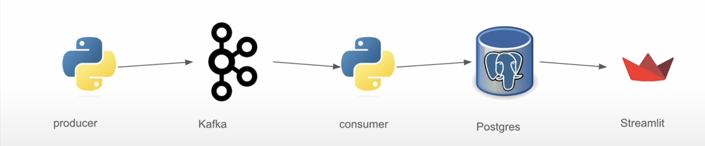

# Sentiment Analysis of Arabic Reviews

This project performs sentiment analysis on Arabic reviews using a pipeline involving Kafka, PostgreSQL, Streamlit, and NLP models from Hugging Face. It processes user reviews, analyzes their sentiment in real-time, and visualizes the results on an interactive UI.

---

## Table of Contents
- [Overview](#overview)
- [Project Architecture](#project-architecture)
- [Features](#features)
- [Technologies Used](#technologies-used)
- [Setup Instructions](#setup-instructions)
- [Usage](#usage)

---

## Overview

This project aims to analyze Arabic user reviews by categorizing them as positive or negative. It leverages natural language processing (NLP) through Hugging Face’s CAMeL-BERT model and presents data in real-time using a Kafka data pipeline and a Streamlit dashboard.

---

## Project Architecture


## Project Structure

```plaintext
.
├── docker-compose.yml           # Orchestrates all services
├── kafka-consumer/              # Kafka consumer component
│   ├── Dockerfile
│   ├── consumer.py              # Processes messages from Kafka
│   ├── requirements.txt
│   └── wait-for-it.sh
├── kafka-producer/              # Kafka producer component
│   ├── Dockerfile
│   ├── producer.py              # Sends messages to Kafka
│   ├── requirements.txt
│   └── wait-for-it.sh
├── postgres/                    # Postgres database setup
│   ├── Dockerfile
│   └── create_table.sql         # SQL script to create tables
├── sentiment-analysis-flow.png  # Workflow diagram
└── ui/                          # User interface component
    ├── Dockerfile
    ├── app.py                   # Main UI application
    └── requirements.txt
```
## Components:
1. **Kafka Producer**: Generates Arabic reviews and sends them to the Kafka topic.
2. **Kafka Consumer**: Consumes reviews, analyzes sentiment, and stores results in PostgreSQL.
3. **PostgreSQL**: Stores review data and sentiment analysis results.
4. **Streamlit UI**: Displays reviews, statistics, and insights.

---

## Features

- **Real-Time Sentiment Analysis**: Arabic text classification with CAMeL-BERT Model.
- **Data Visualization**: Displays latest reviews, sentiment breakdown, and provides in-depth analysis.
- **Insight Generation**: Summarizes key patterns and trends from reviews.

---

## Technologies Used
1. **Apache Kafka** for real-time data streaming.
2. **PostgreSQL** for data storage.
3. **Hugging Face** for sentiment analysis with CAMeL-BERT Model.
4. **Streamlit** for interactive data visualization.
5. **LangChain**  for using Cohere Model for generating insights from large review sets.

## Setup Instructions

### Prerequisites
- Docker 
- Python 3.9+
- Kafka and PostgreSQL (via Docker)
- Hugging Face Transformers

### Steps

1. **Clone the Repository**:
   ```bash
   git clone https://github.com/Hassn11q/RealTime-Arabic-Review-Analysis.git
   cd RealTime-Arabic-Review-Analysis

2. Environment Variables: Create a .env file in the root directory:
```bash
DB_HOST=postgres
DB_NAME=postgres
DB_USER=postgres
DB_PASS=postgres
DB_PORT=5432
COHERE_API_KEY=your_cohere_api_key
```
3. Launch Docker Containers: Start all services using Docker Compose.

```bash
docker-compose up --build
```
4. Initialize Kafka Producer: Run the producer.py to start sending review data to Kafka.
```bash
docker exec -it <kafka-producer-container> python producer.py
```
5. Access the Streamlit UI: Open your browser and go to http://localhost:8501 to view the dashboard.


## Usage
1. **Kafka Producer**: Produces Arabic reviews to a Kafka topic every 30 seconds.
2. **Kafka Consumer**: Listens for new reviews, performs sentiment analysis, and saves data to PostgreSQL.

3. **Streamlit UI**: Provides a real-time view of sentiment statistics and insights.

